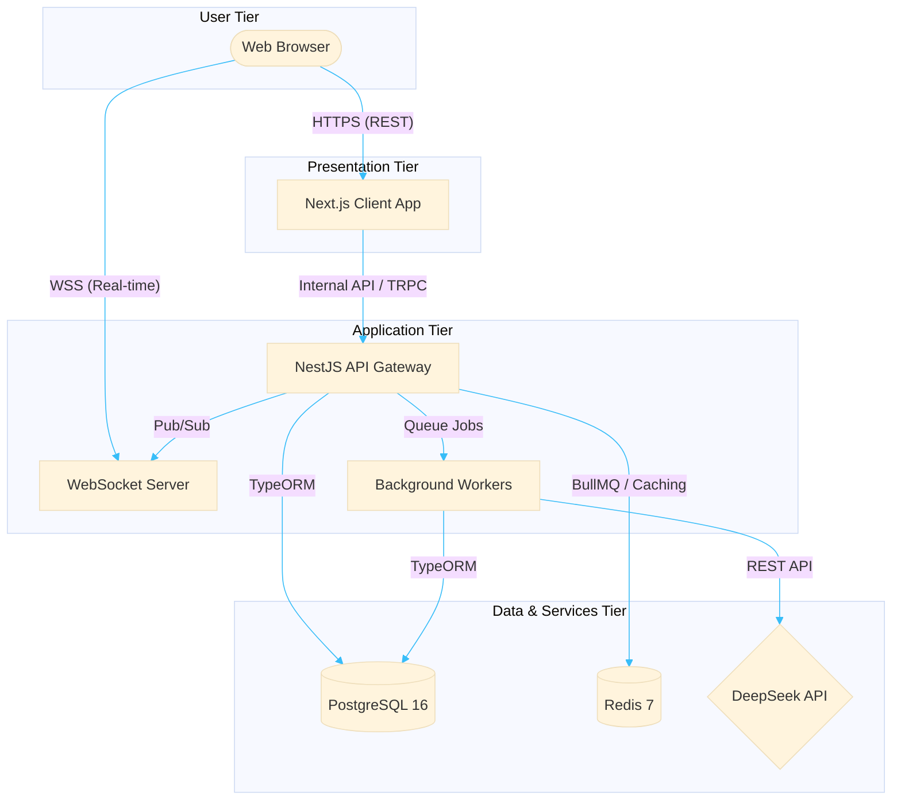
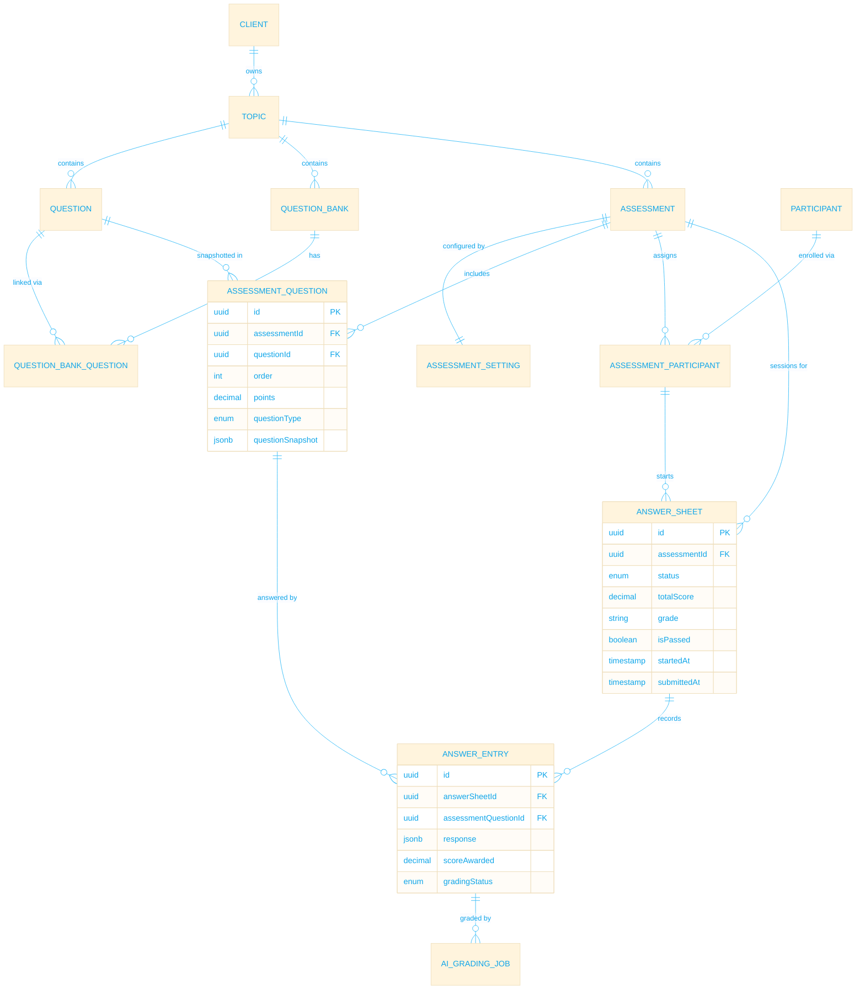

# ❖ System Architecture Overview

This document outlines the architectural blueprint of the Assessment Service, detailing the interactions between the client, backend, and external dependencies.

## ⚙ High-Level Architecture

The system is designed as a decoupled, multi-tier application leveraging modern web technologies for high performance, real-time interactivity, and scalable grading capabilities.

### ✦ Core Components
* **Frontend (Next.js 16)**: Delivers a responsive, server-side rendered application. Utilizes TailwindCSS and customized Shadcn components for premium aesthetics.
* **Backend (NestJS 11)**: Manages business logic, real-time sessions, and asynchronous background tasks.
* **Database (PostgreSQL 16)**: Primary persistent storage for clients, assessments, configurations, and result transcripts.
* **Cache & Message Broker (Redis 7)**: Handles WebSocket state distribution across horizontally scaled backend nodes and manages background job queues (BullMQ).
* **AI Evaluation Engine**: Interfaces with OpenAI to provide automated qualitative grading for subjective assessment types.

## ⛨ Entity Relationship Diagram (ERD)

The core relational data model is designed to support multi-tenancy and complex assessment lifecycles.

### ✦ Data Dictionary Highlights
* **Client**: Represents the tenant organization utilizing the platform.
* **QuestionBank**: A collection of reusable questions.
* **Assessment**: The core configuration mapping a set of QuestionBanks to specific execution settings (e.g., real-time vs. self-paced).
* **AnswerSheet**: The master record of a participant's attempt for a specific assessment.
* **AnswerEntry**: A granular record of a single question's response, grading outcome, and AI feedback.
