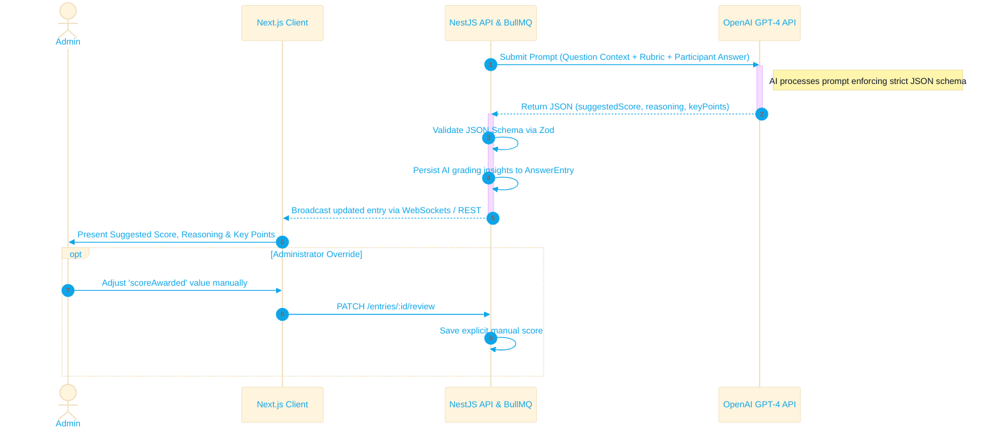

# ✦ AI Grading Provider Guide

The Assessment Service employs Large Language Models (LLMs) to automate the evaluation of subjective question formats, significantly reducing administrative overhead.

## ⚙ Integration Architecture

The system utilizes an abstraction layer over the OpenAI API, allowing for future expansion to other providers (e.g., Anthropic, Gemini).

## ⚙ Prompt Engineering Strategy

The system constructs highly specific prompts to enforce deterministic JSON outputs. The prompt includes:
1. **The Question Context**: The original text and any provided attachments.
2. **The Ideal Answer/Rubric**: Criteria by which the answer should be judged.
3. **The Participant's Answer**: The raw text submitted by the user.
4. **The Output Schema**: Strict instructions to return JSON containing:
   * `suggestedScore` (Float)
   * `reasoning` (String)
   * `keyPointsAddressed` (Array of Strings)
   * `keyPointsMissed` (Array of Strings)
   * `flagForReview` (Boolean)

## ⚙ Fallbacks & Limitations
* **Latency**: AI grading is performed asynchronously via background job queues (BullMQ) to prevent blocking the main thread.
* **Hallucinations**: AI outputs are strictly treated as *suggestions*. Administrators always have the final authority to adjust the `scoreAwarded` and override the AI's recommendation.
